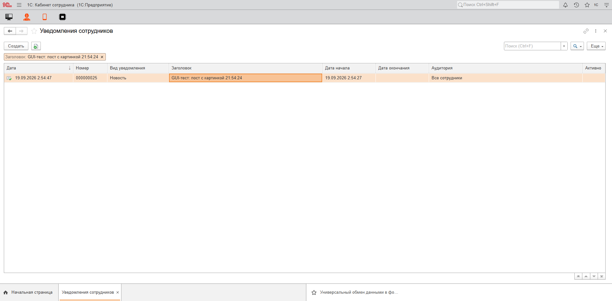
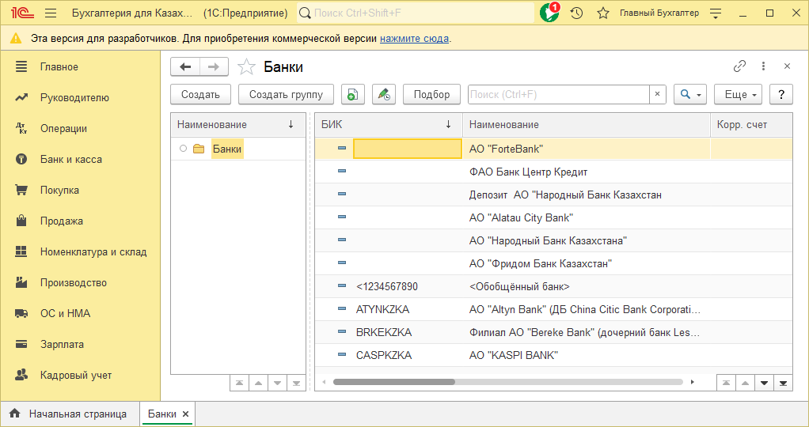

# 1c-gui-test-kit

GUI-тесты для 1С:Предприятие 8.3, которые «кликают» в живой базе так же,
как пользователь: открывают формы, заполняют поля, присоединяют файлы,
проводят документы и **проверяют результат** — а не только факт, что форма
открылась.

Два режима на выбор:

| | Веб-клиент | Толстый / тонкий клиент |
|---|---|---|
| Движок | Playwright + Chromium (навык `web-test`) | Windows UI Automation (навык `1c-client-test`) |
| Сценарий | JavaScript | JSON-список действий |
| Что видит тест | поля с именами и значениями, строки таблиц, HTML-поля | дерево элементов окна, снимки окон |
| Нужно | веб-публикация базы, Node.js 18+ | только платформа 1С |

Есть публикация — тестируйте вебом: проверки там точнее (значения полей,
содержимое таблиц, отрисованные картинки). Толстый клиент — для баз без
публикации и того, что в браузере не воспроизводится.

## Как это выглядит

Сценарий [`post-with-image.js`](scenarios/examples/web/post-with-image.js):
создает документ, пишет текст в HTML-редакторе, присоединяет картинку через
диалог 1С «Выбор файла», проверяет, что в предпросмотре есть заголовок,
текст и **реально отрисованная** картинка, проводит документ, находит его в
списке и убирает за собой.


```
PS> .\gui-test.ps1 -Base Demo -Web -ScriptPath scenarios\examples\web\post-with-image.js
[gui-test] База Demo, веб-клиент http://localhost/demo/, сценарий ...\post-with-image.js
--- вывод сценария ---
OK: текст введен
OK: картинка присоединена -> post-cover
OK: предпросмотр с текстом и картинкой 800x400
OK: документ в списке
OK: тестовый документ помечен на удаление
ИТОГ: сценарий пройден
[OK] Веб-сценарий прошел. Артефакты: ...\artifacts\Demo-20260919-025411
```



Толстый клиент, набор сценариев папки со сводкой:

```
PS> .\gui-test.ps1 -Base Buh -Suite scenarios\examples\thick -URL "e1cib/list/Справочник.Банки"
[READY] PID 24692: Бухгалтерия для Казахстана, редакция 3.0
[PASS] 01-assertNoWindow
[PASS] 02-dismissWindow
[PASS] 03-assertElement
[PASS] 04-assertElement
[PASS] 05-screenshot
[PASS] 06-dumpUi

Scenario                Итог Seconds
--------                ---- -------
catalog-list-smoke.json OK       132

Пройдено 1 из 1.
```



## Быстрый старт

```powershell
git clone https://github.com/qazdefense/1c-gui-test-kit
cd 1c-gui-test-kit
.\setup.ps1                                   # Playwright + Chromium (только для веб-режима)

copy bases\example-server-web.psd1 bases\Demo.psd1   # и поправить: сервер/путь, платформа, пользователь, WebUrl
.\gui-test.ps1 -List                          # база видна, какие режимы доступны

.\gui-test.ps1 -Base Demo -Web -ScriptPath scenarios\examples\web\post-with-image.js
.\gui-test.ps1 -Base Demo -ScenarioPath scenarios\examples\thick\catalog-list-smoke.json -URL "e1cib/list/Справочник.Банки"
```

Профиль базы (`bases\<Имя>.psd1`) хранит платформу, путь или сервер ИБ,
пользователя и URL публикации — в сценариях этих данных нет. Профили с
паролями в `.gitignore`, в репозитории только `example-*`. Папку профилей
можно держать в другом месте: `-BasesDir` или переменная `GUI_TEST_BASES_DIR`.

Требования: Windows, PowerShell 5.1+, **интерактивный разблокированный
рабочий стол** (оба режима показывают настоящие окна). Для веба — пользователь
в строке соединения публикации (`Usr=`/`Pwd=` в `default.vrd`) и Node.js 18+.

## Сценарий пишется вместе с доработкой

Сделали форму или команду — тут же описали, как ею пользуются, и прогнали
в живой базе. Зеленый сценарий остается в `scenarios/<база>/` и дальше
гоняется набором: `.\gui-test.ps1 -Base Demo -Web -Suite scenarios\Demo`.
Цикл, критерии «что считается тестом», работа с тестовыми данными и
готовый фрагмент инструкции для ИИ-агентов (Claude Code, Codex, Gemini) —
[docs/workflow.md](docs/workflow.md).

## Хелперы

В каждый веб-сценарий автоматически подставляется
[`lib/1c-helpers.js`](lib/1c-helpers.js) — готовые решения для мест, где
веб-клиент 1С ведет себя неочевидно:

```js
await uploadFile('Загрузить...', fixture('cover.png'));  // свой диалог 1С, а не браузерный
const preview = await findFrameWithText(TITLE);          // HTML-поле - отдельный iframe
await assertImageRendered(preview);                      // картинка отрисована, а не просто есть тег
if (!(await findListRow(TITLE, 'Заголовок'))) fail('Нет в списке');  // список отдает ~20 строк без отбора
await markForDeletion(TITLE, 'Заголовок');               // Ctrl+Delete в браузере не работает
```

Полный список — в [docs/recipes.md](docs/recipes.md).

## Документация

- [docs/workflow.md](docs/workflow.md) — сценарий вместе с доработкой, тестовые данные, инструкция для агентов
- [docs/recipes.md](docs/recipes.md) — «как сделать вот это»: картинка, HTML-поля, табличные части, списки, отчеты, модальные окна
- [docs/gotchas.md](docs/gotchas.md) — грабли платформы, найденные на живых прогонах (латинское `OK` в диалоге, iframe HTML-полей, пагинация списков, `/DisableStartupDialogs` и другие)
- [skills/web-test/SKILL.md](skills/web-test/SKILL.md) — полный API веб-сценариев
- [skills/1c-client-test/references/scenario.md](skills/1c-client-test/references/scenario.md) — формат JSON-сценария толстого клиента
- [ROADMAP.md](ROADMAP.md) — что планируется

## Состав

```
gui-test.ps1              запуск: база + сценарий, набор (-Suite), артефакты
setup.ps1                 зависимости веб-режима
bases/                    профили баз (example-*.psd1 - образцы)
lib/1c-helpers.js         хелперы веб-сценариев
scenarios/examples/       примеры: web/*.js, thick/*.json
scenarios/_fixtures/      файлы для сценариев (картинки и т.п.)
skills/                   навыки web-test и 1c-client-test (cc-1c-skills, MIT)
docs/                     workflow, рецепты, грабли
```

## Благодарности и лицензия

Движки обоих режимов — навыки из [cc-1c-skills](https://github.com/Nikolay-Shirokov/cc-1c-skills)
(Nick Shirokov, MIT), в редакции форка [ivanarama/cc-1c-skills](https://github.com/ivanarama/cc-1c-skills).
Что изменено в них — [NOTICE.md](NOTICE.md).

Набор распространяется по лицензии [MIT](LICENSE).
