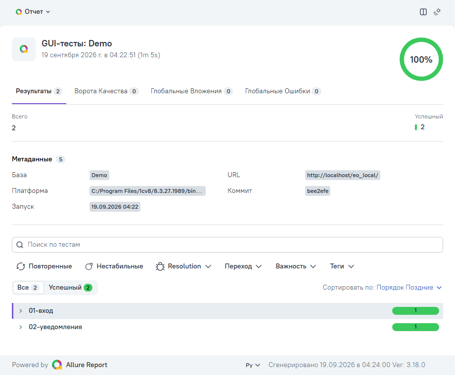
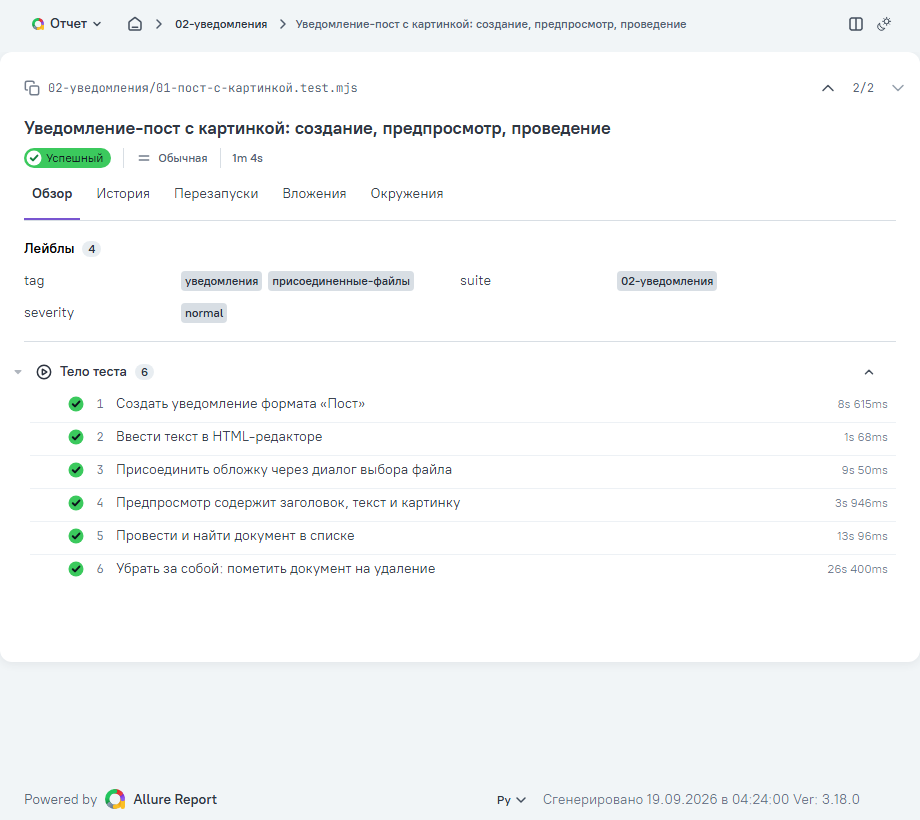
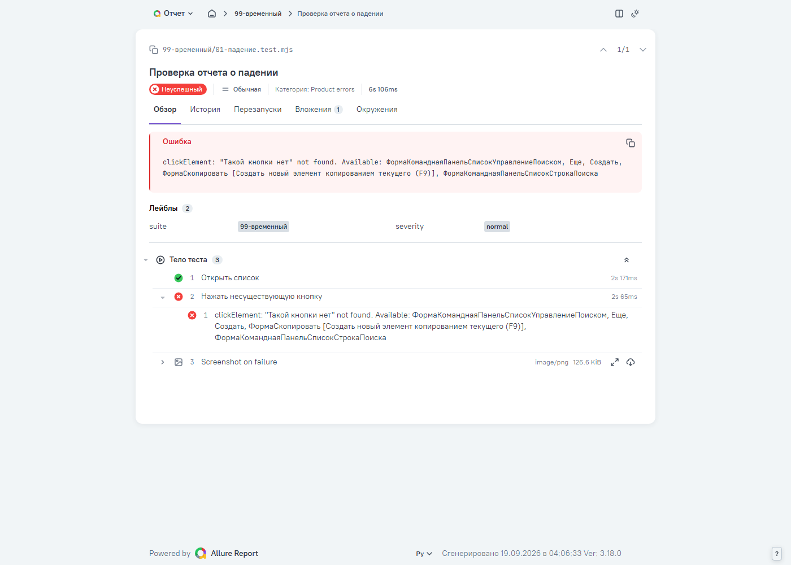
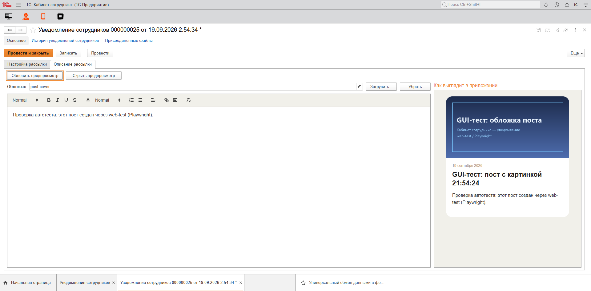

# 1c-gui-test-kit

[](LICENSE)
[](#)
[](skills/web-test/SKILL.md)
[](docs/regression.md)

GUI-тесты для 1С:Предприятие 8.3, которые работают в живой базе как
пользователь: открывают формы, заполняют поля, присоединяют файлы, проводят
документы и **проверяют результат**, а не только то, что форма открылась.
Тесты собираются в регрессионный набор на базу и гоняются одной командой
после каждой загрузки изменений, с отчетом Allure.

```
доработка → загрузка + обновление БД → регресс → отчет → разбор падений
```

| | Веб-клиент | Толстый / тонкий клиент |
|---|---|---|
| Движок | Playwright + Chromium (навык `web-test`) | Windows UI Automation (навык `1c-client-test`) |
| Тест | `*.test.mjs`: шаги, проверки, теги | JSON-список действий |
| Что видит тест | поля с именами и значениями, строки таблиц, HTML-поля | дерево элементов окна, снимки окон |
| Отчет | Allure (HTML одним файлом) / JSON / JUnit, скриншот и видео падения | сводка по сценариям, снимки, дерево UI |
| Нужно | веб-публикация базы, Node.js 18+ | только платформа 1С |

Есть публикация — тестируйте вебом: проверки там точнее. Толстый клиент —
для баз без публикации и того, что в браузере не воспроизводится.

## Как это выглядит

Прогон набора базы:

```
PS> .\gui-test.ps1 -Base Demo -Regress -Allure -OpenReport
[gui-test] Регресс базы Demo (http://localhost/demo/): ...\tests\Demo

web-test -- http://localhost/demo/
Running 2 tests from tests/Demo/

[hooks] публикация отвечает: http://localhost/demo/
  ✓ Открытие базы (0.9s)
  ✓ Уведомление-пост с картинкой: создание, предпросмотр, проведение (64.8s)

2 passed, 0 failed, 0 skipped (1m 5.7s)

[gui-test] Отчет Allure: ...\artifacts\Demo-20260919-042240\allure-report\index.html
[OK] Регресс пройден.
```

Отчет Allure — один HTML-файл, открывается двойным кликом, на русском:



Тест по шагам — видно, где именно проверяется результат:



Падение — шаг, сообщение (для ненайденной кнопки — со списком кнопок,
которые есть на форме), скриншот момента ошибки и категория:



Сам тест [пример](examples/web-test/01-пост-с-картинкой.test.mjs) —
в живой базе:



## Быстрый старт

```powershell
git clone https://github.com/qazdefense/1c-gui-test-kit
cd 1c-gui-test-kit
.\setup.ps1                                          # Playwright + Chromium (для веба)

copy bases\example-server-web.psd1 bases\Demo.psd1   # поправить: сервер/путь, платформа, пользователь, WebUrl
.\gui-test.ps1 -List                                 # база видна, режимы, сколько тестов в наборе

.\gui-test.ps1 -Base Demo -Regress -Allure -OpenReport   # набор tests\Demo (дымовой тест уже есть)
```

Своя база `Buh`:

```powershell
copy bases\example-file.psd1 bases\Buh.psd1         # и поправить
.\gui-test.ps1 -Base Buh -Init                       # заготовка набора tests\Buh
.\gui-test.ps1 -Base Buh -Regress                    # прогон
```

Требования: Windows, PowerShell 5.1+, **интерактивный разблокированный
рабочий стол** (оба режима показывают настоящие окна). Для веба — Node.js
18+ и пользователь в строке соединения публикации (`Usr=`/`Pwd=` в
`default.vrd`): форму входа движок не заполняет. Отчет Allure собирается
через `npx allure@3` — Java не нужна.

## Команды

```powershell
.\gui-test.ps1 -List                                    # базы, публикации, наборы
.\gui-test.ps1 -Base Demo -Regress                      # весь набор, JSON-отчет + сводка
.\gui-test.ps1 -Base Demo -Regress -Allure -OpenReport  # отчет Allure
.\gui-test.ps1 -Regress -TestPath tests\Demo\02-документы   # часть набора; база - из пути
.\gui-test.ps1 -Base Demo -Regress -Tags smoke -Bail    # по тегу, до первого падения
.\gui-test.ps1 -Base Demo -Regress -Grep "накладн" -Retry 1 -Record   # по имени, повтор, видео (ffmpeg)
.\gui-test.ps1 -Base Buh -Init                          # заготовка набора
.\gui-test.ps1 -Base Buh -Suite                         # JSON-сценарии толстого клиента из tests\Buh
.\gui-test.ps1 -Base Buh -ScenarioPath x.json -ValidateScenarioOnly   # проверить сценарий без запуска 1С
.\gui-test.ps1 -Base Demo -Web -ScriptPath recon.js     # разовый сценарий / разведка (не тест)
```

## Набор тестов

```
tests/
  _lib/                     хелперы, подготовка стенда, конфиг Allure, заготовка набора
  _fixtures/                файлы для тестов (картинки и т.п.)
  Demo/                     набор базы Demo (имя = профиль bases\Demo.psd1)
    webtest.config.mjs      таймауты, скриншоты, severity (URL - из профиля)
    _hooks.mjs              подготовка стенда: проверка публикации
    _allure/categories.json классы падений: лицензии, стенд, ошибка 1С, элемент не найден...
    01-вход/01-открытие-базы.test.mjs
    02-<функция>/01-<сценарий>.test.mjs
    03-<функция>/01-<сценарий>.json   сценарий толстого клиента ("url" - в файле)
```

Тест:

```js
import { stamp, uploadFile, fixture, findListRow, markForDeletion } from '../../_lib/1c-helpers.mjs';

export const name = 'Документ с картинкой';
export const tags = ['документы'];
export const timeout = 120000;

const TITLE = stamp('GUI-тест');                       // уникально на каждый прогон

export default async function(ctx) {
  const { navigateLink, clickElement, fillFields, assert, step } = ctx;
  await step('Создать документ', async () => {
    await navigateLink('Документ.МойДокумент');
    await clickElement('Создать');
    await fillFields({ 'Заголовок': TITLE });
  });
  await step('Присоединить картинку', async () => {
    await uploadFile(ctx, 'Загрузить...', fixture('cover.png'));   // свой диалог 1С, а не браузерный
  });
  await step('Документ виден в списке', async () => {
    await clickElement('Записать и закрыть');
    assert.ok(await findListRow(ctx, TITLE, 'Заголовок'), 'Нет в списке');
  });
  await step('Убрать за собой', async () => {
    await markForDeletion(ctx, TITLE, 'Заголовок');
  });
}
```

Хелперы (`tests/_lib/1c-helpers.mjs`) закрывают места, где веб-клиент 1С
ведет себя неочевидно: HTML-поля в отдельных iframe, свой диалог выбора
файла с латинским `OK`, динамический список, который без отбора отдает ~20
строк, неработающий в браузере Ctrl+Delete. Полный список —
[docs/recipes.md](docs/recipes.md).

## Документация

- [docs/workflow.md](docs/workflow.md) — тест пишется вместе с доработкой; тестовые данные; инструкция для ИИ-агентов
- [docs/regression.md](docs/regression.md) — регрессионный набор: структура, запуск, отчет, разбор падений, грабли процесса
- [docs/recipes.md](docs/recipes.md) — «как сделать вот это»: картинка, HTML-поля, табличные части, списки, отчеты, модальные окна
- [docs/gotchas.md](docs/gotchas.md) — грабли веб-клиента 1С, найденные на живых прогонах
- [skills/web-test/SKILL.md](skills/web-test/SKILL.md), [skills/web-test/regress.md](skills/web-test/regress.md) — полный API и режим регресса
- [skills/1c-client-test/references/scenario.md](skills/1c-client-test/references/scenario.md) — формат JSON-сценария толстого клиента
- [ROADMAP.md](ROADMAP.md) — что планируется

## Состав

```
gui-test.ps1        запуск: регресс, набор толстого клиента, разовые сценарии, заготовка набора
setup.ps1           зависимости веб-режима
bases/              профили баз (example-*.psd1 - образцы; свои - в .gitignore)
tests/              наборы тестов по базам + _lib, _fixtures
examples/           примеры: web-test/*.test.mjs, thick/*.json, run/*.js (разовый сценарий)
skills/             навыки web-test и 1c-client-test (cc-1c-skills, MIT)
docs/               workflow, регресс, рецепты, грабли
```

## Благодарности и лицензия

Движки обоих режимов, включая регрессионный раннер, — навыки из
[cc-1c-skills](https://github.com/Nikolay-Shirokov/cc-1c-skills) (Nick
Shirokov, MIT), в редакции форка [ivanarama/cc-1c-skills](https://github.com/ivanarama/cc-1c-skills).
Что изменено в них — [NOTICE.md](NOTICE.md).

Набор распространяется по лицензии [MIT](LICENSE).
